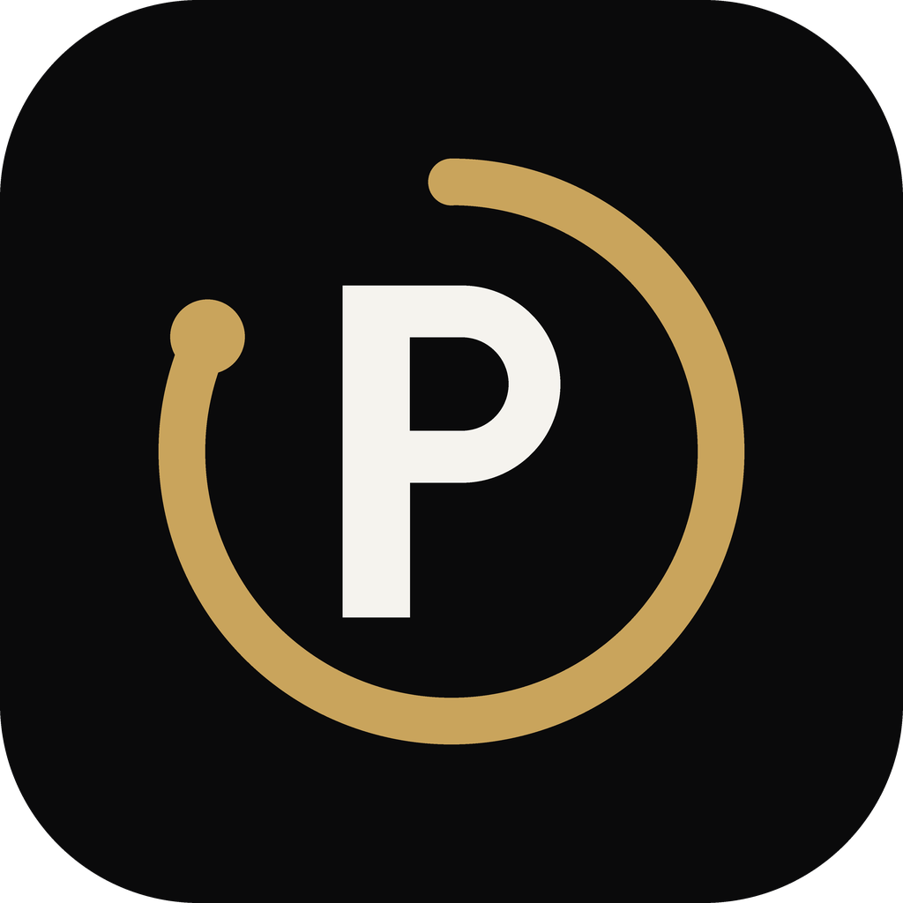
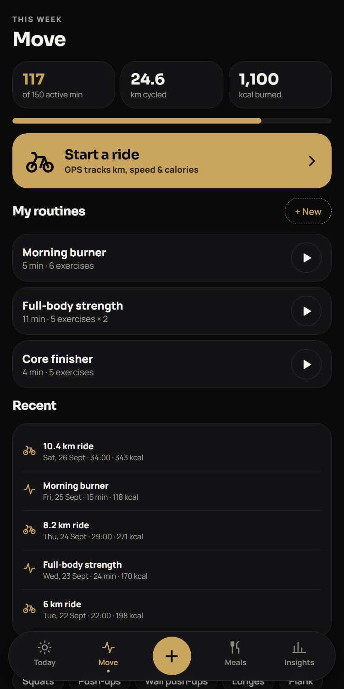
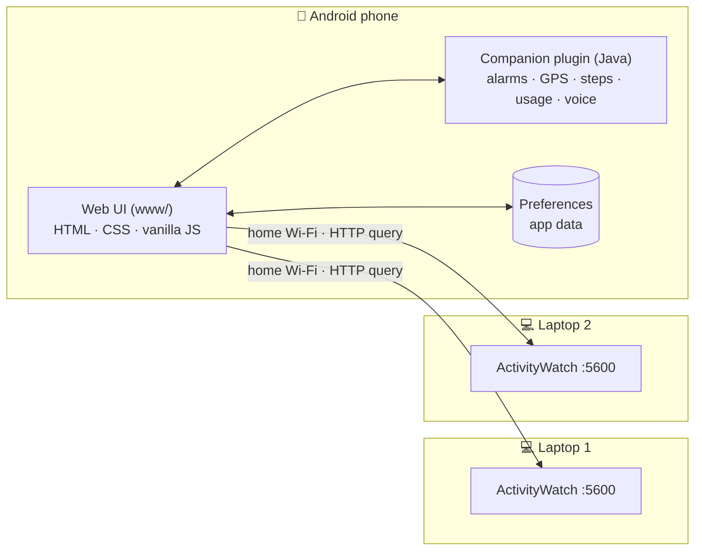

<div align="center">



# Priyatham Health

**A personal health companion for Android that remembers everything for you.**
Water · workouts · GPS rides · weekly meal plans with prep alarms · calories & protein · sleep · weight · screen time across phone and laptops.


[**⬇ Download the APK**](https://github.com/priyathamtella/priyatham-health/releases/latest) · [Features](docs/FEATURES.md) · [Install on Android](docs/INSTALL-ANDROID.md) · [Connect laptops](docs/LAPTOP-SETUP.md) · [Build from source](docs/BUILD-FROM-SOURCE.md)

</div>

---

## Contents

- [Why this app](#why-this-app)
- [Screenshots](#screenshots)
- [Features at a glance](#features-at-a-glance)
- [Quick start](#quick-start)
- [How it works](#how-it-works)
- [Repository structure](#repository-structure)
- [Build from source](#build-from-source)
- [Privacy](#privacy)
- [Roadmap](#roadmap)

---

## Why this app

Most health apps are abandoned within 1–3 months: too many notifications, too much typing, and nagging that makes you feel guilty. Priyatham Health is built the other way round:

| Principle | What it means in the app |
|---|---|
| **Smart, polite reminders** | Water nudges skip if you just drank. Stand breaks only during work hours. Quiet hours at night. |
| **Real alarms when it matters** | Cooking prep, workouts and weekly planning **ring** (or **vibrate** on silent) until you tick them. |
| **One tap per log** | +250 ml straight from the notification. "Ate it" confirms a planned meal. |
| **Automatic where possible** | Steps from the phone's sensor, GPS rides, and screen time from your phone and laptops. |
| **Private by default** | No account and no cloud. Everything is stored on your phone. |

---

## Screenshots

<table>
  <tr>
    <td align="center"><br><sub><b>Today</b>: score + timeline</sub></td>
    <td align="center"><br><sub><b>Weekly meal plan</b></sub></td>
    <td align="center"><br><sub><b>Prep countdown</b></sub></td>
  </tr>
  <tr>
    <td align="center"><br><sub><b>Move</b>: routines & rides</sub></td>
    <td align="center"><br><sub><b>Workout timer</b> with voice coach</sub></td>
    <td align="center"><br><sub><b>Screen time</b>: phone + 2 laptops</sub></td>
  </tr>
  <tr>
    <td align="center"><br><sub><b>Calories & protein</b></sub></td>
    <td align="center"><br><sub><b>Sleep</b> check-in & trend</sub></td>
    <td align="center"><br><sub><b>Alarm styles</b> per reminder</sub></td>
  </tr>
</table>

<details>
<summary>More screens</summary>

| Water | Weight & body | GPS ride |
|---|---|---|
|  |  |  |

</details>

---

## Features at a glance

| Area | Highlights |
|---|---|
| ⏰ **Alarms & reminders** | Real alarms that **ring when sound is on and vibrate on silent**, plus a full-screen alarm and a notification. Choose Alarm / Notification / Vibrate per reminder type. Survives reboots. |
| 🍳 **Meal planner + prep alarms** | Weekly breakfast/lunch/dinner grid. Recipes carry prep steps (soak → grind → ferment…). The app **counts back from mealtime**, moves steps out of your sleep hours, and repeats every 15 min, getting more urgent up to the **final call**. |
| 🥗 **Calories & protein** | 40+ Indian non-veg foods, 23 recipes, one-tap "Ate it" for planned meals. Personal kcal and protein targets. |
| 🏋️ **Workouts** | Build your own routines. Big countdown ring, **voice coach**, 3-2-1 beeps, auto-logged calories. |
| 🚴 **GPS cycling** | Tap *Start ride*: km, speed, calories, climb and a route drawing. Keeps recording with the screen off. |
| 💧 **Water** | Goal from your weight (+500 ml on active days), animated glass, smart nudges. |
| 😴 **Sleep** | 5-second morning check-in, 7-night chart against the 7–9 h target, bedtime consistency, and late-night phone-use insight. |
| ⚖️ **Weight & body** | Trend line, BMI, waist, goal ETA at a safe pace. |
| 💻 **Screen time** | Phone (Android Usage Access) + **two Windows laptops** via free ActivityWatch over home Wi-Fi. Work vs leisure, "is this healthy?" checks. |
| 📅 **Weekly ritual** | Saturday 6 pm alarm to plan next week's meals, with a shopping list and "copy last week". |

➡ Full details: **[docs/FEATURES.md](docs/FEATURES.md)**

---

## Quick start

### 📱 On your Android phone
1. Download **`PriyathamHealth-v1.1.apk`** from **[Releases](https://github.com/priyathamtella/priyatham-health/releases/latest)** (on the phone, or copy it over).
2. Tap it → allow *Install unknown apps* for your browser/Files → **Install** (if Play Protect warns: *More details → Install anyway*).
3. Open the app, fill in the welcome screen, then allow each permission on **Set up your phone**.
4. On OnePlus/Oppo/Xiaomi/Samsung phones, set battery to **Unrestricted** so alarms can't be killed.

➡ Step-by-step, including every Android prompt you'll see: **[docs/INSTALL-ANDROID.md](docs/INSTALL-ANDROID.md)**

### 💻 On each Windows laptop (optional, for screen time)
1. Install **[ActivityWatch](https://github.com/ActivityWatch/activitywatch/releases/latest)** (free) and start it once.
2. Download this repo (green **Code → Download ZIP**) and run, in a normal PowerShell window:
   ```powershell
   powershell -ExecutionPolicy Bypass -File .\laptop\setup-laptop.ps1
   ```
3. Set your Wi-Fi to **Private** and add the firewall rule the script prints (these are the only admin steps).
4. In the app: **Insights → Connect laptops →** the IP the script printed, port `5600` → **Test & add**.

➡ Full guide and troubleshooting: **[docs/LAPTOP-SETUP.md](docs/LAPTOP-SETUP.md)**

### 🛠 From source (developers)
```bash
git clone https://github.com/priyathamtella/priyatham-health.git
cd priyatham-health
npm install
npx cap sync android
cd android && ./gradlew assembleDebug        # Windows: gradlew.bat assembleDebug
```
➡ Toolchain setup and signing: **[docs/BUILD-FROM-SOURCE.md](docs/BUILD-FROM-SOURCE.md)**

---

## How it works



- **UI**: a fast single-page app (no framework) in [`www/`](www), wrapped by **Capacitor 7**.
- **Native layer**: one Java plugin, [`CompanionPlugin`](android/app/src/main/java/com/priyatham/health/CompanionPlugin.java), handles exact alarms (`AlarmManager.setAlarmClock`), full-screen alarm activity, ringer-aware ring/vibrate, a GPS foreground service, the hardware step counter, `UsageStatsManager` screen time and text-to-speech.
- **Laptops**: [ActivityWatch](https://activitywatch.net) records app usage locally. The phone asks each laptop for today's per-app totals when both are on the same Wi-Fi.

➡ Deep dive: **[docs/ARCHITECTURE.md](docs/ARCHITECTURE.md)**

---

## Repository structure

```text
priyatham-health/
├── www/                      # the app UI (single-page app, no build step)
│   ├── index.html
│   ├── styles.css            # brand: black · white · muted gold
│   ├── core.js               # state, reminder engine, prep planner, scoring
│   ├── ui.js                 # router, icons, rings, sheets, nav
│   ├── views-today.js        # welcome, setup, Today, alarms, settings
│   ├── views-move.js         # routines, workout timer, GPS ride
│   ├── views-food.js         # meal plan, prep, recipes, food log, water
│   ├── views-insights.js     # screen time, laptops, sleep, body
│   ├── native.js             # bridge to the Java plugin (+ browser fallbacks)
│   └── data.js               # default foods, recipes, exercises, routines
├── android/                  # Capacitor Android project
│   └── app/src/main/java/com/priyatham/health/
│       ├── CompanionPlugin.java   # JS ⇄ native API
│       ├── AlarmScheduler.java    # exact alarms, repeats, windows
│       ├── AlarmReceiver.java     # ring / vibrate / notify
│       ├── AlarmActivity.java     # full-screen ringing alarm
│       ├── ActionReceiver.java    # Done · Snooze · +250 ml buttons
│       ├── RideService.java       # GPS foreground service
│       ├── Steps.java             # hardware step counter
│       ├── BootReceiver.java      # re-arm after reboot/update
│       └── Store.java
├── laptop/                   # Windows helpers for ActivityWatch
│   ├── setup-laptop.ps1      # one-command setup
│   ├── aw-keepalive.ps1      # hidden auto-start + self-heal
│   └── uninstall-autostart.ps1
├── brand/                    # logo (PNG, SVG, lockup)
├── docs/                     # guides, screenshots, printable PDF
├── tools/                    # logo generator, screenshot seeder
├── capacitor.config.json
├── package.json
└── CHANGELOG.md
```

---

## Build from source

| Need | Version |
|---|---|
| Node.js | 20+ |
| JDK | 21 (Temurin) |
| Android SDK | platform 35, build-tools 35 |

```bash
npm install
npx cap sync android
cd android
./gradlew assembleRelease   # signed if android/keystore.properties exists
```

Preview the UI in a desktop browser (native features are simulated):
```bash
cd www && python -m http.server 8765    # open http://localhost:8765
```

➡ Details, signing and troubleshooting: **[docs/BUILD-FROM-SOURCE.md](docs/BUILD-FROM-SOURCE.md)**

---

## Privacy

- **No account, no server, no analytics.** App data lives in the phone's app storage.
- Laptop screen time is read **directly over your home Wi-Fi**. The firewall rule only opens port 5600 on *Private* networks.
- Backups are a copy-paste text blob you control (*Settings → Copy backup*).
- Health targets and tips are general wellness guidance, **not medical advice**.

---

## Roadmap

- [ ] Health diary: symptoms, reports, doctor-visit PDF
- [ ] Weekly review screen with trends and one small goal
- [ ] Map tiles for rides (currently route-only drawing)
- [ ] Optional encrypted cloud backup
- [ ] Home-screen widget (water + today's score)

See **[CHANGELOG.md](CHANGELOG.md)** for release history.

---

<div align="center">

<br><sub>Designed and built for Priyatham · black, white & muted gold</sub>
</div>
