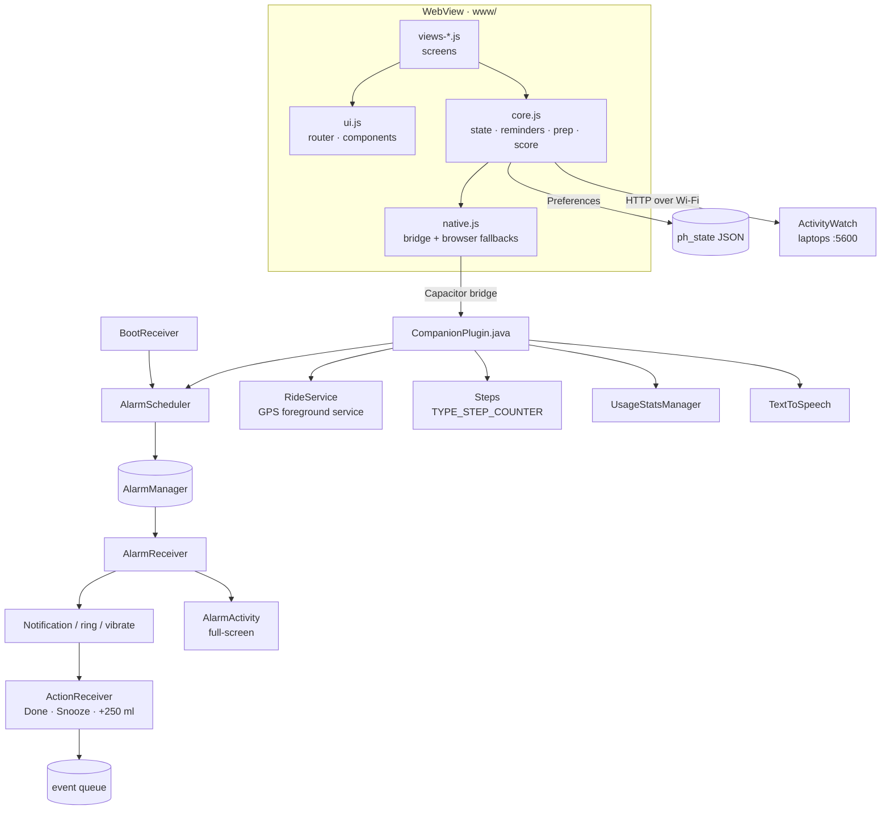
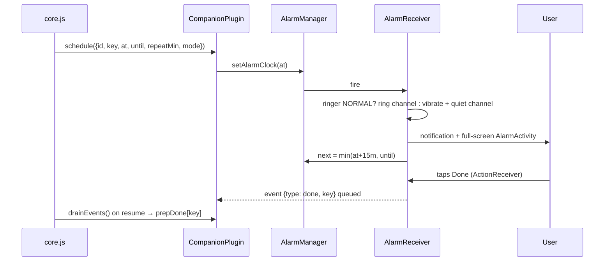

# Architecture

[← Back to README](../README.md)

- [Overview](#overview)
- [Web layer (`www/`)](#web-layer-www)
- [Native layer (Java plugin)](#native-layer-java-plugin)
- [Alarms: end to end](#alarms-end-to-end)
- [Prep planner algorithm](#prep-planner-algorithm)
- [GPS rides](#gps-rides)
- [Screen time](#screen-time)
- [Data model](#data-model)
- [Design system](#design-system)

---

## Overview



- **Capacitor 7** hosts the web UI in a WebView and exposes a single custom plugin, `Companion`.
- Everything the app needs to do **while it's closed** (alarms, reminders, notification buttons, GPS recording, step snapshots) is native. Everything else is web.
- Actions taken from notifications while the app is closed are queued natively and **drained** by the web layer on resume (`PH.drain()`).

## Web layer (`www/`)

| File | Responsibility |
|---|---|
| `core.js` | `S` state load/save (Capacitor Preferences), `H` helpers, `B` body math (BMI, targets), `T` day totals, `Prep` planner + alarm sync, `Rem` recurring reminder builder, `score()` |
| `ui.js` | Hash router (`#/today`, `#/timer/<id>`, …), event delegation via `data-a` (click) and `data-c` (change), icons, rings, sheets, toasts, bottom nav |
| `views-today.js` | Welcome, permission setup, Today timeline, alarm styles, settings, quick log |
| `views-move.js` | Routines + editor, workout timer engine (phases, voice, beeps, wake lock), GPS ride screen |
| `views-food.js` | Weekly planner, prep countdown, recipes editor, food log, water |
| `views-insights.js` | Screen time (phone + ActivityWatch), laptops, sleep, weight/body |
| `native.js` | `N.*` wrappers around `Capacitor.Plugins.Companion`, with simulated fallbacks for browser preview |
| `data.js` | Default foods, recipes (with prep steps), exercises, routines, app-category keyword lists |

There's no framework and no build step: plain ES2019 scripts loaded in order from `index.html`.

## Native layer (Java plugin)

| Class | Role |
|---|---|
| `CompanionPlugin` | Plugin API: `schedule`, `cancel`, `cancelPrefix`, `list`, `drainEvents`, `markEvent`, `testAlarm`, `status`, `request`, `openSettings`, `steps`, `usage`, `speak`, `vibrate`, `startRide`, `pauseRide`, `rideState`, `stopRide` |
| `AlarmScheduler` | Persists alarms (SharedPreferences JSON), arms them with `setAlarmClock` (alarm style) or `setExactAndAllowWhileIdle`, computes the next occurrence (`repeatMin/until`, `daily`, `weekly`, `interval` within a daily window) |
| `AlarmReceiver` | Fires: skip logic (`skipKey/skipMin`), escalation text, ringer-aware channel choice, direct vibration with `USAGE_ALARM`, full-screen intent, `FLAG_INSISTENT`, reschedules the series |
| `AlarmActivity` | Lock-screen alarm UI (time, pulsing gold bell, Done / Snooze / Open app) |
| `ActionReceiver` | Notification buttons → event queue, `lastEvent` timestamps, snooze as a one-off alarm |
| `BootReceiver` | Re-arms all alarms on boot, package update, time/time-zone change |
| `RideService` | Foreground service (`location` type), `LocationManager` GPS at 1 s / 2 m, accuracy and jump filters, auto-pause, MET calories, climb, sampled track |
| `Steps` | Reads `TYPE_STEP_COUNTER` once, folds the delta into today's total, handles reboot resets, plus a nightly 23:58 snapshot |

## Alarms: end to end



**Notification channels**

| Channel | Importance | Sound / vibration |
|---|---|---|
| `ph_alarm_ring` | High, bypasses DND | Default **alarm** tone (`USAGE_ALARM`), vibration pattern |
| `ph_alarm_quiet` | High | Silent. The receiver vibrates directly (alarm usage) when the phone is on silent/vibrate |
| `ph_nudge` | High | Default notification sound, short vibration |
| `ph_ride` | Low | Ongoing ride status |

## Prep planner algorithm

Each recipe step has a `wait` (minutes from that step to the next step, or to the meal). For each planned meal:

```text
next = mealTime
for step in reversed(steps):
    latest   = next - step.wait
    deadline = latest, or (sleepStart - 15 min) if latest falls in the sleep window
    lead     = 180 min if wait ≥ 4 h, 45 min if wait ≥ 1 h, else 20 min
    planned  = deadline - lead, pushed to wake-up time if it falls asleep
    next     = deadline
```

Alarms fire at `planned`, repeat every 15 min, and the last one is the **final call** at `deadline`. Keys are `prep:<date>:<meal>:<stepIndex>`, and `H.hash(key)` gives the stable alarm id. Re-planning cancels the `prep:` prefix and reschedules.

## GPS rides

- Started from the UI after the `location` permission, as a foreground service with an ongoing notification (*"8.42 km · 0:32:15 · 286 kcal"*).
- A fix counts only if accuracy is ≤ 30 m. Segments faster than 80 km/h are treated as GPS jumps.
- Distance, moving time and calories accumulate only above 2 km/h (auto-pause).
- Calories = MET(speed) × weight(kg) × hours, with MET 3.5 (< 10 km/h) up to 15.8 (> 30 km/h).
- The UI polls `rideState()` every second and draws the track as an SVG path.

## Screen time

- **Phone:** `UsageStatsManager.queryEvents` from local midnight. Foreground sessions are paired `ACTIVITY_RESUMED` → `ACTIVITY_PAUSED` / screen off. Launchers and System UI are excluded. The overlap with 23:00–05:00 is counted as *late night*.
- **Laptops:** ActivityWatch query API (`POST /api/0/query/`):
  ```text
  afk  = flood(query_bucket(find_bucket("aw-watcher-afk_")));
  win  = flood(query_bucket(find_bucket("aw-watcher-window_")));
  win  = filter_period_intersect(win, filter_keyvals(afk, "status", ["not-afk"]));
  RETURN = sort_by_duration(merge_events_by_keys(win, ["app"]));
  ```
  Requests go through Capacitor's native HTTP (`CapacitorHttp`), so there's no CORS issue, and cleartext is allowed for LAN IPs.
- **Categories:** keyword lists in `data.js` (work / leisure), browsers count as work, and user overrides are stored in `appCats`.

## Data model

All app data is one JSON object (`ph_state`) in Capacitor Preferences:

| Key | Shape |
|---|---|
| `profile` | name, sex, age, heightCm, weightKg, goalKg, wake, sleep, workStart, workEnd, workoutTime, goals[], onboarded, setupDone |
| `mealTimes` | `{breakfast, lunch, dinner}` as `HH:mm` |
| `alerts` | style per type: `alarm` · `notify` · `vibrate` |
| `reminders` | on/off + interval/day/time per reminder |
| `plan` | `{ "YYYY-MM-DD": { breakfast: {r: recipeId} \| {t: "text"}, … } }` |
| `prepDone` | `{ prepKey: timestamp }` |
| `food` | `{ date: [{meal, name, qty, kcal, protein, …}] }` |
| `water` | `{ date: [{t, ml}] }` |
| `sleep` | `{ date: {bed, wake, q, tags[]} }` |
| `weights` | `[{d, kg, waist?}]` |
| `workouts`, `rides` | activity history |
| `steps`, `stands` | per-day counters |
| `screen` | `{ date: { phone: {...}, <deviceId>: {total, apps[], at} } }` |
| `foods`, `recipes`, `exercises`, `routines` | user-editable libraries (seeded from `data.js`) |
| `devices` | laptops `{id, name, ip, port, host, lastOk, err}` |
| `appCats` | per-app category overrides |

## Design system

| Token | Value | Use |
|---|---|---|
| Black | `#0A0A0B` | Background (brand primary) |
| Surface | `#141416` / `#1C1C1F` | Cards |
| White | `#F5F3EE` | Text |
| Muted gold | `#C9A45C` / `#E6CD94` | Accent, rings, primary buttons |
| Electric blue | `#4C82FF` | Tech only: GPS, device/permission hints |
| Display font | Sora 600–700 | Headings, numbers |
| Body font | Manrope 400–800 | Everything else |

Motion: staggered rise-in, ring sweeps, pulsing "now" dots, water waves and route drawing. All of it is disabled under `prefers-reduced-motion`.
