# Features

[← Back to README](../README.md)

Everything Priyatham Health does, screen by screen.

- [1. First launch](#1-first-launch)
- [2. Today](#2-today)
- [3. Alarms & reminders](#3-alarms--reminders)
- [4. Meals: weekly plan, recipes and prep alarms](#4-meals-weekly-plan-recipes-and-prep-alarms)
- [5. Food: calories and protein](#5-food-calories-and-protein)
- [6. Move: workouts and the timer](#6-move-workouts-and-the-timer)
- [7. GPS cycling](#7-gps-cycling)
- [8. Water](#8-water)
- [9. Sleep](#9-sleep)
- [10. Weight & body](#10-weight--body)
- [11. Insights: screen time](#11-insights-screen-time)
- [12. Settings, backup and privacy](#12-settings-backup-and-privacy)
- [How targets are calculated](#how-targets-are-calculated)

---

## 1. First launch

| Step | What happens |
|---|---|
| **Welcome** | Name, sex, age, height, weight, goal weight, wake-up, sleep, work hours, workout time, and goals (lose weight, fix sleep, get fit, cook at home, less screen time). |
| **Set up your phone** | One screen with every permission, each with an **Allow** button and a live ✓ once it's granted: notifications, exact alarms, full-screen alarms, ignore battery optimisation, physical activity, location, usage access. |
| **Test alarm / Test nudge** | Fires in 5 seconds so you can hear it (sound on) and feel it (silent). |

## 2. Today

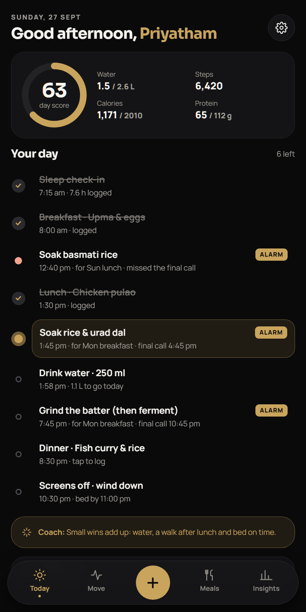

- **Day score (0–100)** from water, steps, protein, calories, sleep and activity, shown as an animated gold ring.
- **Quick stats**: water, steps, calories, protein against your targets.
- **Your day timeline** in time order:
  - planned meals (✓ once logged)
  - prep steps (*soak, grind, marinate*) with the **final call** time
  - next water nudge, workout slot, sleep check-in, weekly planning (Saturday), wind-down
  - status: **gold pulse** = happening now, **✓** = done, **red dot** = missed
- **Coach tip** that adapts: short sleep, behind on water, low protein…
- The gold **+** button opens **Quick log**: +250 ml, food, weight, ride, workout, sleep check-in, stand break, prep tasks.

 

## 3. Alarms & reminders

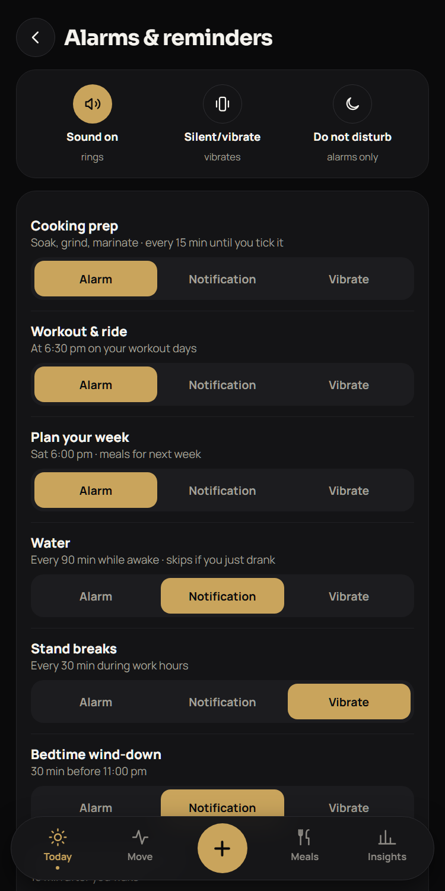

**Three styles**, chosen per reminder type:

| Style | Sound on | Silent / vibrate | Do not disturb |
|---|---|---|---|
| **Alarm** | Rings (alarm tone, repeats) + full-screen alarm + notification | Strong vibration + full-screen alarm + notification | Still comes through |
| **Notification** | Normal notification | Follows the phone's mode | Held back |
| **Vibrate** | Vibration + silent notification | Vibration + silent notification | Held back |

**Reminder types (defaults):**

| Reminder | Default style | When |
|---|---|---|
| Cooking prep | Alarm | From each step's planned time, every 15 min until done or the final call |
| Workout & ride | Alarm | Your workout time, on the days you choose |
| Plan your week | Alarm | Saturday 6:00 pm (day and time editable) |
| Water | Notification | Every 60/90/120 min while awake. **Skipped if you drank in the last 45 min.** Has a **+250 ml** button. |
| Stand breaks | Vibrate | Every 30/45/60 min during work hours |
| Bedtime wind-down | Notification | 30 min before your sleep time |
| Morning check-in | Notification | 15 min after you wake |
| Weekly weigh-in | Notification | Sunday 8:00 am |

**Reliability:** exact alarms via `AlarmManager.setAlarmClock`, re-armed after reboot, app update and time-zone change. Notification buttons (**Done**, **Snooze 10 min**, **+250 ml**) work without opening the app.

 

## 4. Meals: weekly plan, recipes and prep alarms

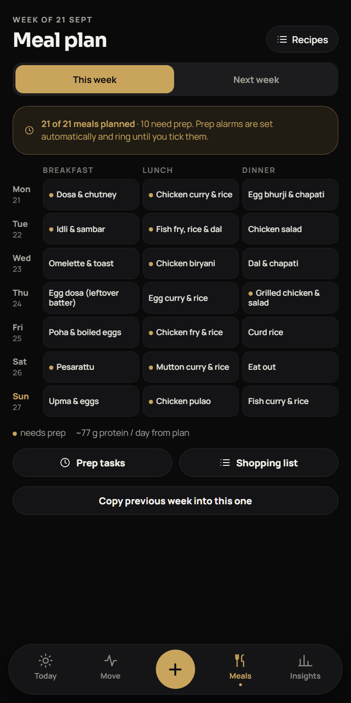

- **Weekly grid**: Mon–Sun × breakfast / lunch / dinner, with **This week / Next week** tabs.
- Tap a cell to pick a recipe (searchable), type anything (*Eat out*, *Leftovers*), or clear it.
- A **gold dot** marks recipes with prep steps. Their alarms are **scheduled automatically** when you save the plan.
- **Shopping list** built from the week's recipes, with tick boxes.
- **Copy previous week** in one tap.
- **Recipes** screen: edit what one serving contains (for calories), the prep steps with wait times, and ingredients. Create your own.

 

### How prep timing works

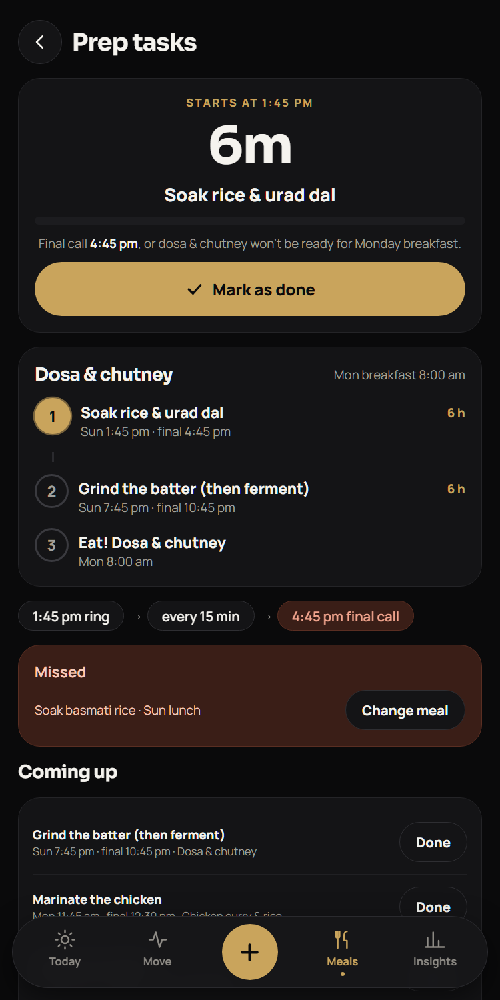

Each recipe step has a **wait**: how long must pass before the next step or the meal. The planner:

1. **Counts back** from the meal time you set (breakfast 8:00, lunch 1:30, dinner 8:30 by default).
2. If a step would land **while you sleep**, it moves to **before bed** (15 min before your sleep time is the final call).
3. The **first alarm** rings a little before the final call: 3 h before for long soaks, 45 min for marinades, 20 min for quick steps.
4. It **repeats every 15 minutes**, with the message getting more urgent: *"2 h 30 min left…"*, *"40 min left before the final call…"*, then **"FINAL CALL"**.
5. Missed steps turn **red** on Today and in Prep tasks, with a **Change meal** button.

**Example: dosa for Monday 8:00 am** (soak 6 h → grind → ferment 6 h), bedtime 11 pm:

| Step | First alarm | Final call |
|---|---|---|
| Soak rice & urad dal | Sun 1:45 pm | Sun 4:45 pm |
| Grind the batter (then ferment) | Sun 7:45 pm | Sun 10:45 pm |
| Make dosa | Mon 8:00 am, batter fermented overnight | |

 

## 5. Food: calories and protein

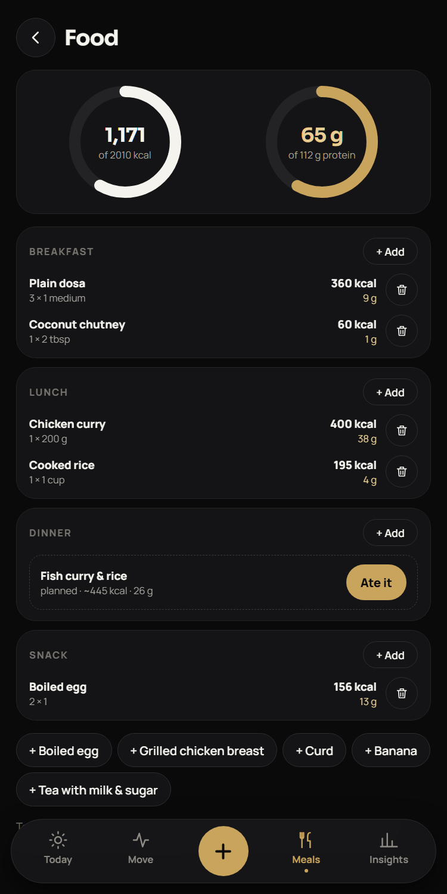

- Two animated rings: **calories** and **protein** against your targets.
- Sections for breakfast, lunch, dinner and snack. A planned meal shows **"Ate it"** to log its whole recipe in one tap.
- **Add food**: search 40+ Indian non-veg foods (dosa, idli, pesarattu, chicken curry, biryani, fish fry, mutton, egg dishes, dal, rice, chapati, curd…), set servings (½ steps) and the meal.
- **Create a food** with your own calories and protein.
- Quick chips: boiled egg, grilled chicken, curd, banana, tea.
- **Protein coach** after 3 pm if you're short: *"Try 150 g chicken or a cup of curd."*

 

## 6. Move: workouts and the timer

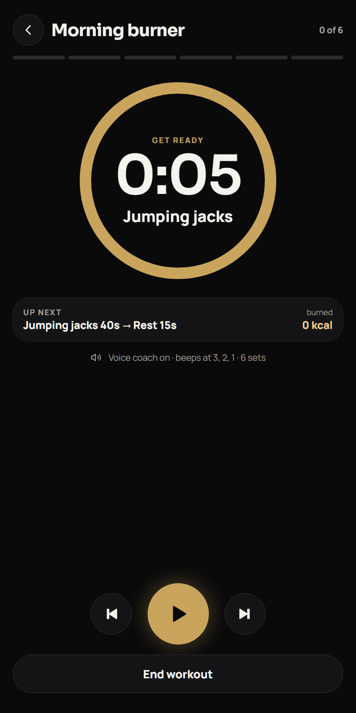

- **This week**: active minutes (goal 150), km cycled, kcal burned.
- **Routines**: three built in (*Morning burner*, *Full-body strength*, *Core finisher*). Create or edit your own with exercises, work/rest seconds and rounds.
- **My exercises**: add any exercise you like.
- **Workout timer**:
  - large countdown ring, with the current exercise and what's up next
  - **voice coach** (*"Squats. 40 seconds. Go!"*), with beeps and vibration at 3-2-1
  - progress segments and live calories
  - pause, skip, previous, end. The screen stays awake.
- Finished workouts are saved and count toward your day score and weekly minutes.

 

## 7. GPS cycling

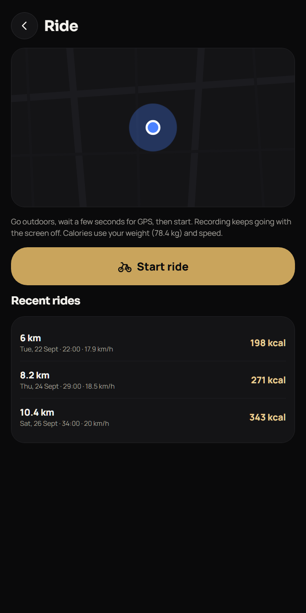

- **Start ride** asks for location if needed, then runs a **foreground service**, so it keeps recording with the screen off.
- Live: **distance**, **time**, **speed**, **calories** (MET by speed × your weight), **climb**, GPS accuracy.
- **Auto-pause** below 2 km/h. GPS jumps are filtered out.
- Your route is drawn live in gold, with a pulsing blue *you are here* dot.
- **Finish** → summary (km, time, average speed, kcal) → saved to history, and the voice coach reads the result.

 

## 8. Water

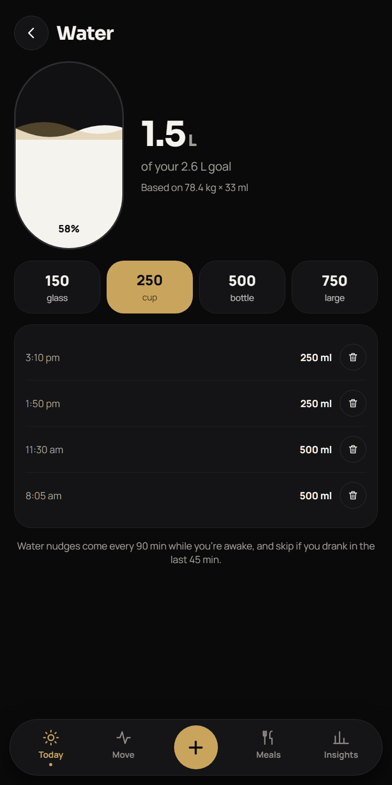

- Daily goal = **33 ml × your weight**, **+500 ml** on days with a workout or ride.
- Animated glass with a double wave, plus 150 / 250 / 500 / 750 ml buttons.
- Today's log with delete.
- Logging (in the app or from the notification) postpones the next nudge.

 

## 9. Sleep

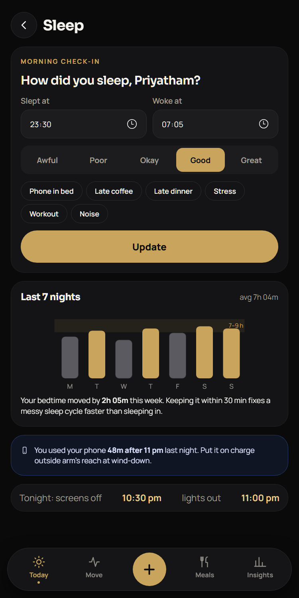

- **Morning check-in**: slept at, woke at, quality (Awful → Great), tags (phone in bed, late coffee, late dinner, stress, workout, noise).
- **Last 7 nights** bar chart against the 7–9 h target band.
- **Consistency**: how much your bedtime moved this week, and why that matters.
- **Late-night phone use** (after 11 pm, from Usage Access), shown with its effect on sleep.
- Tonight's plan: screens off 30 min before bed, then lights out.

 

## 10. Weight & body

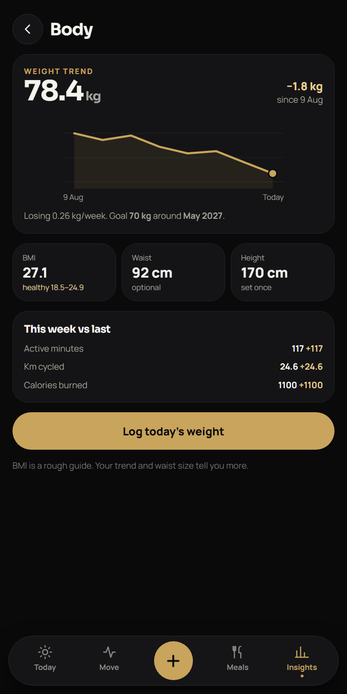

- Weight trend line (last 16 weigh-ins) with an animated draw.
- **BMI** (with the healthy range), waist, height.
- **Goal ETA** from your real rate of loss, with a warning if the pace is too fast.
- This week vs last week: active minutes, km cycled, calories burned.

 

## 11. Insights: screen time

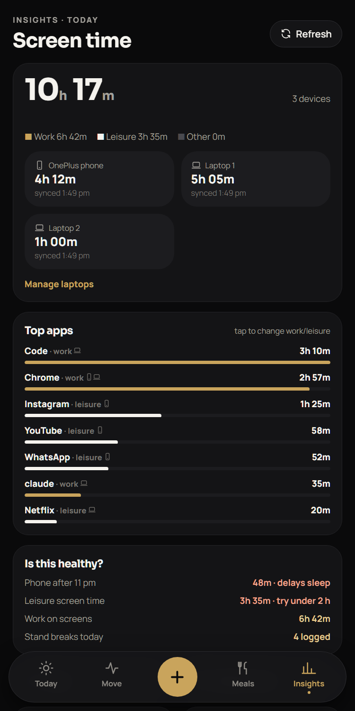

- **Total today** across your phone and every connected laptop.
- **Work / leisure / other** split bar. Tap any app to change its category.
- **Per-device cards** with the last sync time, or the error if a laptop can't be reached.
- **Top apps**, merged across devices, with device icons.
- **Is this healthy?**
  - phone after 11 pm
  - leisure over 3 h
  - work screens over 9 h
  - stand breaks logged
- Laptops use **ActivityWatch**, counting only time you're actively at the laptop (AFK filtered out). See [LAPTOP-SETUP.md](LAPTOP-SETUP.md).

 

## 12. Settings, backup and privacy

- Profile, daily routine and **meal times**. Prep alarms count back from these.
- Links to alarms & reminders, phone permissions and laptops.
- **Copy backup / Restore**: your whole app state as a text blob.
- No account, no server, no analytics.

---

## How targets are calculated

| Target | Formula |
|---|---|
| Calories | Mifflin-St Jeor BMR × 1.4 (light activity) − 400 kcal; floor 1500 (men) / 1200 (women) |
| Protein | 1.6 g × goal weight |
| Water | 33 ml × current weight, +500 ml on active days |
| Active minutes | 150 per week (WHO guideline) |
| Sleep | 7–9 h per night |
| Weight-loss pace | 0.25–0.5 kg per week is flagged as healthy |
| Ride calories | MET by speed (3.5 → 15.8) × weight × moving hours |
| Workout calories | MET 5.5 × weight × active hours |

*Tips and targets are general wellness guidance, not medical advice.*
